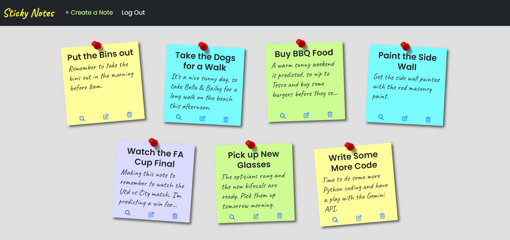

# sticky-notes

## Description

Sticky Notes is a simple and intuitive Django web application that allows users to create, view, and manage personal notes. Each note consists of a title and content, styled to resemble real sticky notes with a decorative red pin at the top. This application aims to enhance productivity by providing a visually appealing and easy-to-use interface for note-taking.

## Table of Contents

- [Installation](#installation)
- [Usage](#usage)
- [Screenshots](#screenshots)
- [Credits](#credits)
- [License](#license)

## Installation

To install and run the Sticky Notes app locally, follow these steps:

1. Clone the repository (or download the files):
    ```sh
    git clone https://github.com/sandcoders/sticky-notes.git
    ```
    
2. Install dependencies: Make sure you have Python and pip installed, then run:
    ```sh
    pip install -r requirements.txt
    ```  

3. Navigate into the project directory that includes the manage.py file.

4. To utilise Django's admin functionalities, you'll need to create a superuser:
    ```sh
    python manage.py createsuperuser
    ```

5. Start the application server using:
    ```sh  
    python manage.py runserver
    ```

## Usage

To use the Sticky Notes app:

1. Open your web browser and go to: http://localhost:8000/admin

2. Log in with the credentials you created during the superuser setup.

3. Once logged in, click on "View site" in the admin menu bar.

4. Click on "+ Create a Note" in the site menu bar to start creating and managing your sticky notes.

5. The app has full user authentication, so you could navigate to the front end at http://localhost:8000/ and log in there instead.

6. You can set up more users by following the "sign-up" link from the login page.

## Screenshots

Here is a screenshot of the Sticky Notes noteboard:



## Credits

This project is developed and maintained by:

- [Sandcoders](https://github.com/sandcoders)

## License

This project is licensed under the MIT License - see the [LICENSE](https://github.com/git/git-scm.com/blob/main/MIT-LICENSE.txt) file for details.
